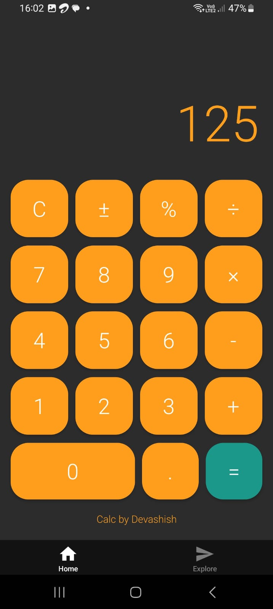
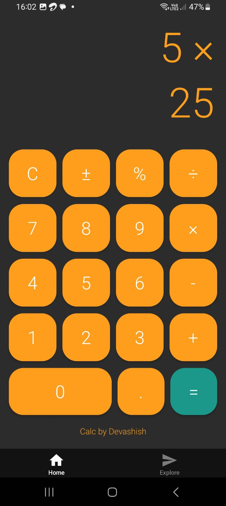
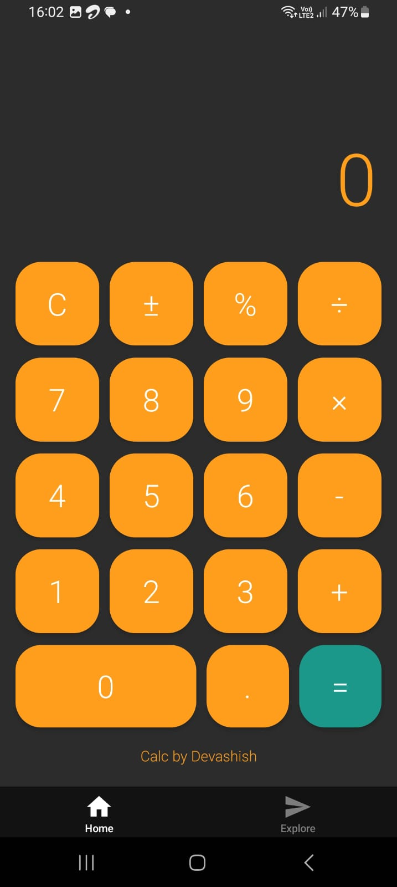

# Calculator App ✨

_Author_: Devashish Sanjay Gaikwad

## 🖥️ About the Project

This is a modern and elegant calculator mobile application built using _React Native_. The app features a clean, unique UI with excellent performance optimizations, making it stand out from the crowd. Designed to handle basic arithmetic operations, this calculator is user-friendly and highly responsive.

---

## 🚀 Features

### 🌟 _UI/UX Highlights_

- _Unique Color Scheme_:
  - _Background_: Deep dark (#15141A)
  - _Number Buttons_: Rich navy (#2A2D3E)
  - _Operator Buttons_: Deep slate (#2D3047) with amber text (#FF9F1C)
  - _Equal Button_: Teal green (#1B998B)
  - _Function Buttons_: Slate gray (#454B66)
- _Refined Layout_:
  - Smooth animations
  - Responsive design for all screen sizes
  - Auto-scaling text for the display
  - Rounded buttons with shadow effects
  - Signature line at the bottom: _"Calc by Aadit"_

### ⚡ _Performance Optimizations_

- _Efficient State Management_: Optimized for re-renders using React.memo, useCallback, and useMemo.
- Lightweight and fast execution.

### 🧮 _Functional Features_

- Basic Arithmetic Operations: Addition, Subtraction, Multiplication, and Division.
- Percentage Calculations.
- Decimal and Sign Toggle Support.
- Continuous Calculation Support.
- Clear Functionality.

---

## 📲 Installation

### Prerequisites

- _Node.js_ (https://nodejs.org)
- _Expo CLI_ (https://expo.dev/tools)

### Steps to Run Locally

1. Clone the repository:

   ```bash
   git clone https://github.com/itachi538/calculatorApp.git

   ```

2. Install Dependencies:

```bash
  npm install
```

3. Start the development server:

```bash
  npx expo start
```

4. Scan the QR Code:

- Android: Open the expo go app and scan the QR code using in-app scanner
- IOS: Open your Iphone camera and scan the given QR code.

### ⚡ Contact Information:

- Author: Devashish Sanjay Gaikwad
- Email: devashishgaikwad8@gmail.com
- GitHub: https://github.com/itachi538

### ⚡ Image:




